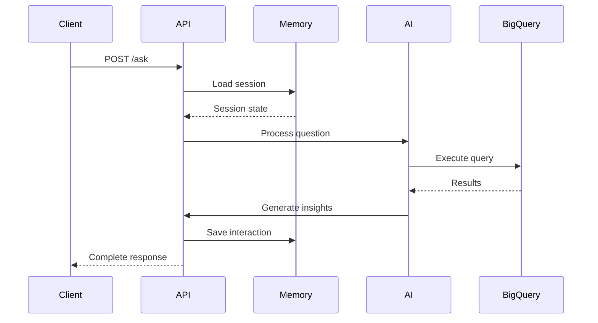

# API Reference 🔌

## Endpoints Overview

```mermaid
graph LR
    A[API Root] --> B[/ask]
    A --> C[/health]
    A --> D[/conversation]
    
    B --> E[Process Question]
    C --> F[Check Status]
    D --> G[Get History]
    
    style A fill:#f9f,stroke:#333,stroke-width:2px
    style B fill:#bbf,stroke:#333,stroke-width:2px
    style C fill:#bfb,stroke:#333,stroke-width:2px
    style D fill:#fbf,stroke:#333,stroke-width:2px
```

## 1. Ask Questions (`POST /ask`)

Submit questions about your data and get SQL-powered insights.

### Request Format
```json
{
    "question": "string",
    "session_id": "string (optional)"
}
```

### Response Format
```json
{
    "query": "string (generated SQL)",
    "result": [
        ["column1", "column2"],
        ["value1", "value2"]
    ],
    "insights": "string (AI analysis)",
    "token_usage": {
        "total_tokens": "integer",
        "intent_tokens": "integer",
        "query_tokens": "integer",
        "answer_tokens": "integer"
    },
    "session_id": "string",
    "conversation_count": "integer"
}
```

### Example: Trending Movies

**Request:**
```bash
curl -X POST http://localhost:8000/ask \
  -H "Content-Type: application/json" \
  -d '{
    "question": "what are the trending movies in germany this month?",
    "session_id": "user123"
  }'
```

**Response:**
```json
{
    "query": "SELECT \n  c.title,\n  COUNT(sf.showtime_id) AS num_showtimes\nFROM \n  `cogent-tine-87309.usheru_data_mart.content_dimension` c\n  JOIN `cogent-tine-87309.usheru_data_mart.showtime_fact` sf ON c.content_id = sf.content_id\n  JOIN `cogent-tine-87309.usheru_data_mart.cinema_dimension` cd ON sf.cinema_id = cd.cinema_id\nWHERE \n  cd.cinema_country = 'Germany'\n  AND c.content_type = 'Film'\n  AND DATE(sf.local_show_datetime) >= DATE_SUB(CURRENT_DATE(), INTERVAL 30 DAY)\nGROUP BY \n  c.title\nORDER BY \n  num_showtimes DESC\nLIMIT 10",
    "result": [
        ["title", "num_showtimes"],
        ["Movie 1", "156"],
        ["Movie 2", "143"]
    ],
    "insights": "Based on cinema showings in the past 30 days, 'Movie 1' is currently the most trending film in Germany with 156 showings, followed by 'Movie 2' with 143 showings.",
    "token_usage": {
        "total_tokens": 2873,
        "intent_tokens": 184,
        "query_tokens": 2156,
        "answer_tokens": 533
    },
    "session_id": "user123",
    "conversation_count": 1
}
```

## 2. Health Check (`GET /health`)

Check system status and database connection.

### Response Format
```json
{
    "status": "string (healthy/unhealthy)",
    "database": "string (connection status)",
    "project": "string (BigQuery project)",
    "dataset": "string (BigQuery dataset)",
    "full_dataset": "string (project.dataset)"
}
```

### Example

**Request:**
```bash
curl http://localhost:8000/health
```

**Response:**
```json
{
    "status": "healthy",
    "database": "connected",
    "project": "cogent-tine-87309",
    "dataset": "usheru_data_mart",
    "full_dataset": "cogent-tine-87309.usheru_data_mart"
}
```

## 3. Conversation History (`GET /conversation/{session_id}`)

Retrieve conversation history for a session.

### Response Format
```json
{
    "session_id": "string",
    "history": [
        {
            "question": "string",
            "answer": "string",
            "timestamp": "string (ISO format)"
        }
    ]
}
```

### Example

**Request:**
```bash
curl http://localhost:8000/conversation/user123
```

**Response:**
```json
{
    "session_id": "user123",
    "history": [
        {
            "question": "what are the trending movies in germany this month?",
            "answer": "Based on cinema showings in the past 30 days...",
            "timestamp": "2024-03-14T15:30:45.123Z"
        }
    ]
}
```

## Request Flow



## Error Handling

The API uses standard HTTP status codes:

- `200`: Success
- `400`: Bad request (invalid input)
- `500`: Server error (query failed)

### Common Error Responses

1. **Query Too Large**
```json
{
    "query": "...",
    "result": [
        ["Error"],
        ["Query exceeded limit for bytes billed: 500000000"]
    ],
    "insights": "Query too large for processing limits. Try asking for a smaller date range or specific subset of data."
}
```

2. **Type Mismatch**
```json
{
    "query": "...",
    "result": [
        ["Error"],
        ["No matching signature for operator >= for argument types: DATETIME, TIMESTAMP"]
    ],
    "insights": "Query execution failed due to date type mismatch."
}
```

## Rate Limits

- Maximum request size: 1MB
- Timeout: 30 seconds
- Query size: 500MB processed data
- Results: 10 rows maximum
- History: 5 conversations per session 