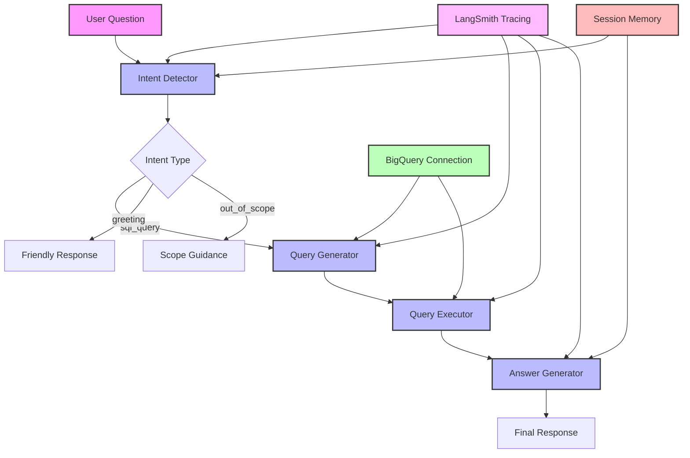
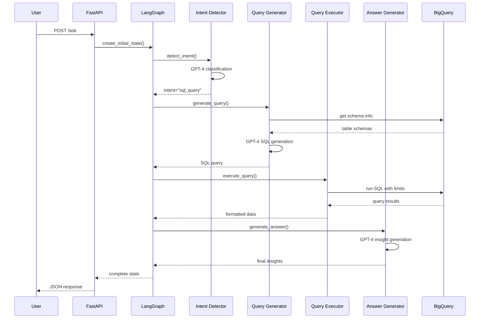
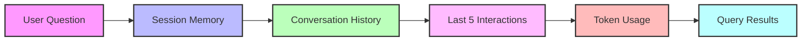

# Architecture Overview 🏗️

## System Components

The BigQuery SQL Agent is built with a modular architecture that processes natural language questions through a series of specialized AI agents.



## Component Details

### 1. Intent Detector
- Uses GPT-4 to classify user questions
- Handles greetings, SQL queries, and out-of-scope requests
- Maintains conversation context

### 2. Query Generator
- Converts natural language to BigQuery SQL
- Applies safety limits and best practices
- Handles schema information

### 3. Query Executor
- Runs SQL with safety limits
- Manages BigQuery connection
- Handles errors gracefully

### 4. Answer Generator
- Creates natural language insights
- Formats results for display
- Maintains conversation history

## Data Flow



## Directory Structure

```
app/
├── agents/          # AI processing agents
│   ├── intent_detector.py    # Classify user intent
│   ├── query_generator.py    # Generate BigQuery SQL
│   ├── query_executor.py     # Execute queries safely
│   └── answer_generator.py   # Create natural responses
├── core/           # System core
│   ├── state.py    # State management
│   └── graph.py    # LangGraph workflow
├── db/             # Database layer
│   └── connection.py # BigQuery connection
├── models.py       # API models
└── main.py         # FastAPI app
```

## Technology Stack

- **FastAPI**: Web framework
- **LangGraph**: Workflow orchestration
- **OpenAI GPT-4**: Language model
- **BigQuery**: Database
- **LangSmith**: Tracing and monitoring
- **tiktoken**: Token counting

## Memory Management

