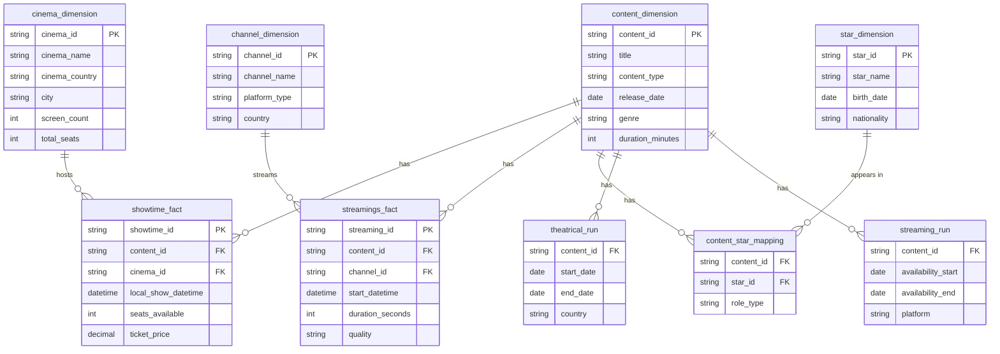

# Database Schema 📊

## Overview

The BigQuery dataset (`usheru_data_mart`) contains tables for tracking movies, shows, cinema showings, and streaming data.



## Table Details

### 1. Content Tables

#### `content_dimension`
Primary table for movies and shows:
- `content_id`: Unique identifier
- `title`: Content title
- `content_type`: Film/Show/etc.
- `release_date`: Initial release
- `genre`: Content genre
- `duration_minutes`: Runtime

#### `star_dimension`
Talent information:
- `star_id`: Unique identifier
- `star_name`: Actor/director name
- `birth_date`: Date of birth
- `nationality`: Country of origin

#### `content_star_mapping`
Links content to talent:
- `content_id`: References content
- `star_id`: References star
- `role_type`: Actor/Director/etc.

### 2. Exhibition Tables

#### `showtime_fact`
Cinema showing data:
- `showtime_id`: Unique identifier
- `content_id`: Content being shown
- `cinema_id`: Theater showing
- `local_show_datetime`: Show time
- `seats_available`: Remaining seats
- `ticket_price`: Cost per ticket

#### `cinema_dimension`
Theater information:
- `cinema_id`: Unique identifier
- `cinema_name`: Theater name
- `cinema_country`: Country location
- `city`: City location
- `screen_count`: Number of screens
- `total_seats`: Venue capacity

### 3. Streaming Tables

#### `streamings_fact`
Individual streaming events:
- `streaming_id`: Unique identifier
- `content_id`: Content streamed
- `channel_id`: Platform used
- `start_datetime`: Stream start
- `duration_seconds`: Watch time
- `quality`: Stream quality

#### `channel_dimension`
Streaming platform data:
- `channel_id`: Unique identifier
- `channel_name`: Platform name
- `platform_type`: Service type
- `country`: Operating country

### 4. Availability Tables

#### `theatrical_run`
Cinema release windows:
- `content_id`: Content reference
- `start_date`: Theater release
- `end_date`: End of run
- `country`: Release territory

#### `streaming_run`
Streaming availability:
- `content_id`: Content reference
- `availability_start`: Stream start
- `availability_end`: Stream end
- `platform`: Service name

## Common Queries

### Trending Movies
```sql
SELECT 
  c.title,
  COUNT(sf.showtime_id) AS showing_count
FROM 
  `content_dimension` c
  JOIN `showtime_fact` sf ON c.content_id = sf.content_id
WHERE 
  DATE(sf.local_show_datetime) >= DATE_SUB(CURRENT_DATE(), INTERVAL 30 DAY)
  AND c.content_type = 'Film'
GROUP BY 
  c.title
ORDER BY 
  showing_count DESC
LIMIT 10
```

### Popular Stars
```sql
SELECT 
  s.star_name,
  COUNT(DISTINCT c.content_id) AS content_count
FROM 
  `star_dimension` s
  JOIN `content_star_mapping` csm ON s.star_id = csm.star_id
  JOIN `content_dimension` c ON csm.content_id = c.content_id
WHERE 
  c.release_date >= DATE_SUB(CURRENT_DATE(), INTERVAL 365 DAY)
GROUP BY 
  s.star_name
ORDER BY 
  content_count DESC
LIMIT 10
```

### Streaming Analytics
```sql
SELECT 
  c.title,
  COUNT(*) AS stream_count,
  AVG(sf.duration_seconds)/60 AS avg_watch_minutes
FROM 
  `content_dimension` c
  JOIN `streamings_fact` sf ON c.content_id = sf.content_id
WHERE 
  DATE(sf.start_datetime) >= DATE_SUB(CURRENT_DATE(), INTERVAL 7 DAY)
GROUP BY 
  c.title
ORDER BY 
  stream_count DESC
LIMIT 10
``` 