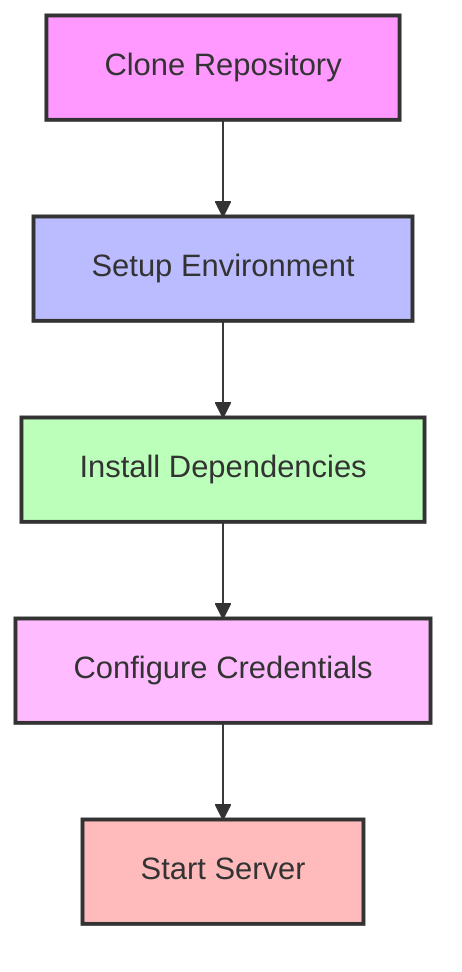
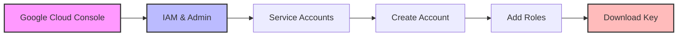

# Installation Guide 🛠️

## Prerequisites

1. **Python Environment**
   - Python 3.9 or higher
   - Virtual environment tool (venv/conda)

2. **Google Cloud**
   - Google Cloud account
   - BigQuery enabled
   - Service account with BigQuery access

3. **OpenAI**
   - API key for GPT-4
   - Organization ID (optional)

4. **LangSmith** (optional)
   - Account for tracing
   - API key

## Quick Start



### 1. Clone Repository
```bash
git clone <repository-url>
cd usheru-sql-agent
```

### 2. Setup Environment
```bash
# Using venv
python -m venv venv
source venv/bin/activate  # Linux/Mac
venv\Scripts\activate     # Windows

# Using conda
conda create -n usheru-sql python=3.9
conda activate usheru-sql
```

### 3. Install Dependencies
```bash
pip install -r requirements.txt
```

### 4. Configure Environment Variables
Create a `.env` file:
```ini
# BigQuery
GOOGLE_CLOUD_PROJECT=cogent-tine-87309
GOOGLE_CLOUD_DATASET=usheru_data_mart
GOOGLE_APPLICATION_CREDENTIALS=service_account.json

# OpenAI
OPENAI_API_KEY=your-api-key
OPENAI_ORG_ID=your-org-id  # Optional

# LangSmith (Optional)
LANGCHAIN_TRACING_V2=true
LANGCHAIN_ENDPOINT=https://api.smith.langchain.com
LANGCHAIN_API_KEY=your-langsmith-key
LANGCHAIN_PROJECT=usheru-sql-agent

# Server
HOST=0.0.0.0
PORT=8000
```

### 5. Start Server
```bash
python run.py
```

## Configuration Details

### BigQuery Setup

1. **Service Account**
   - Go to Google Cloud Console
   - Create service account
   - Grant BigQuery roles:
     - `roles/bigquery.dataViewer`
     - `roles/bigquery.jobUser`
   - Download JSON key as `service_account.json`



2. **Dataset Access**
   - Verify service account email
   - Grant dataset access:
     ```sql
     GRANT `roles/bigquery.dataViewer`
     ON SCHEMA `cogent-tine-87309.usheru_data_mart`
     TO "service-account@project.iam.gserviceaccount.com";
     ```

### OpenAI Setup

1. **API Key**
   - Visit OpenAI dashboard
   - Create API key
   - Add to `.env` file

2. **Model Configuration**
   ```python
   # app/core/config.py
   OPENAI_MODEL = "gpt-4"
   MAX_TOKENS = 8192
   TEMPERATURE = 0.7
   ```

### LangSmith Setup (Optional)

1. **Account Creation**
   - Sign up at LangSmith
   - Create new project
   - Get API key

2. **Tracing Configuration**
   ```python
   # app/core/config.py
   LANGCHAIN_TRACING_V2 = True
   LANGCHAIN_PROJECT = "usheru-sql-agent"
   ```

## Security Best Practices

1. **Environment Variables**
   - Never commit `.env` file
   - Use secrets management in production
   - Rotate API keys regularly

2. **Service Account**
   - Use minimal permissions
   - Restrict to specific dataset
   - Regular key rotation

3. **API Security**
   - Enable CORS protection
   - Rate limiting
   - Input validation

## Production Deployment

### Docker Setup
```dockerfile
FROM python:3.9-slim

WORKDIR /app
COPY requirements.txt .
RUN pip install -r requirements.txt

COPY . .
CMD ["python", "run.py"]
```

### Docker Compose
```yaml
version: '3'
services:
  api:
    build: .
    ports:
      - "8000:8000"
    env_file:
      - .env
    volumes:
      - ./service_account.json:/app/service_account.json:ro
```

### Kubernetes (Example)
```yaml
apiVersion: apps/v1
kind: Deployment
metadata:
  name: usheru-sql-agent
spec:
  replicas: 3
  template:
    spec:
      containers:
      - name: api
        image: usheru-sql-agent:latest
        env:
        - name: GOOGLE_APPLICATION_CREDENTIALS
          value: /secrets/service-account.json
        volumeMounts:
        - name: google-cloud-key
          mountPath: /secrets
          readOnly: true
      volumes:
      - name: google-cloud-key
        secret:
          secretName: service-account-key
```

## Troubleshooting

### Common Issues

1. **BigQuery Connection**
   ```python
   # Test connection
   from google.cloud import bigquery
   client = bigquery.Client()
   client.query("SELECT 1").result()
   ```

2. **OpenAI API**
   ```python
   # Test API key
   import openai
   openai.api_key = "your-key"
   openai.ChatCompletion.create(
       model="gpt-4",
       messages=[{"role": "user", "content": "test"}]
   )
   ```

3. **LangSmith Tracing**
   ```python
   # Verify tracing
   import langsmith
   client = langsmith.Client()
   client.list_projects()
   ```

### Logs Location
```
logs/
├── api.log        # API requests
├── bigquery.log   # Query execution
├── openai.log     # Model calls
└── error.log      # Error tracking
```

## Monitoring

### Health Metrics
- API response time
- Query execution time
- Token usage
- Error rates

### Cost Tracking
- BigQuery bytes processed
- OpenAI token count
- API request volume

## Updates and Maintenance

### Version Updates
1. Check `requirements.txt`
2. Test in staging
3. Deploy to production
4. Monitor for issues

### Database Changes
1. Update schema documentation
2. Adjust query templates
3. Test with sample questions
4. Deploy changes 