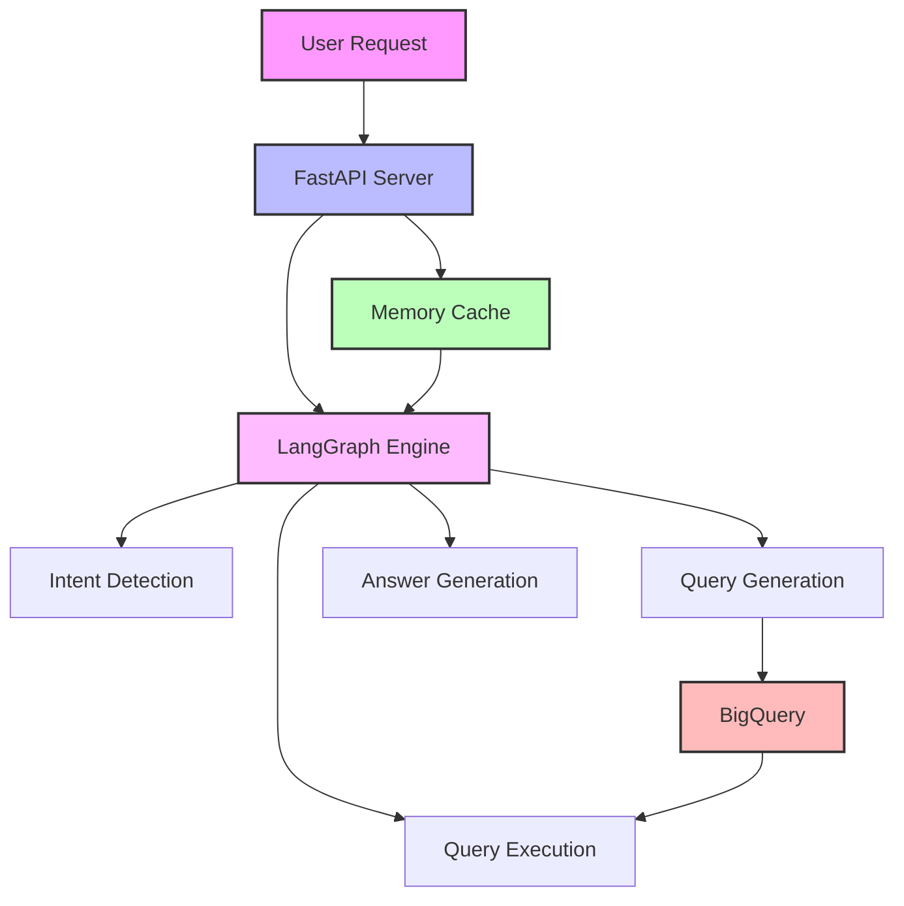
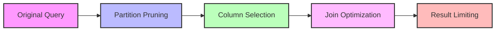
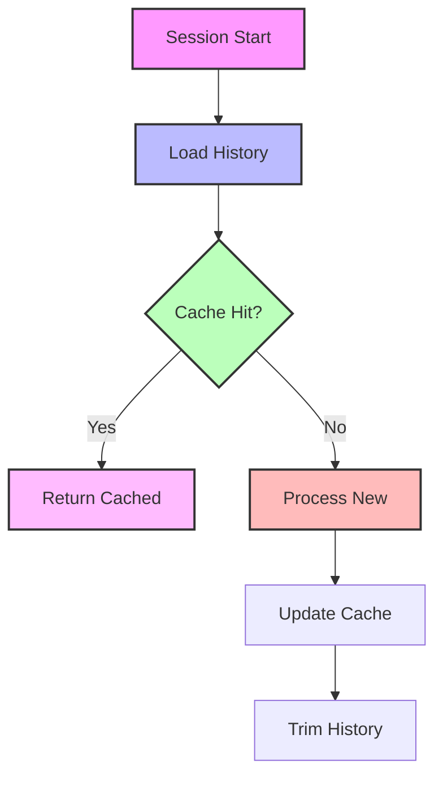
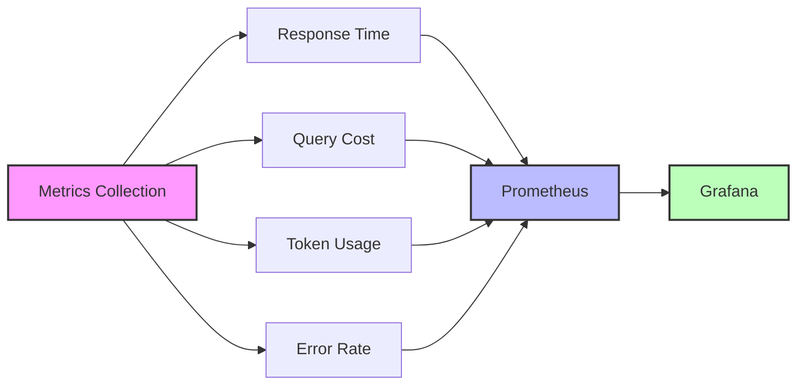
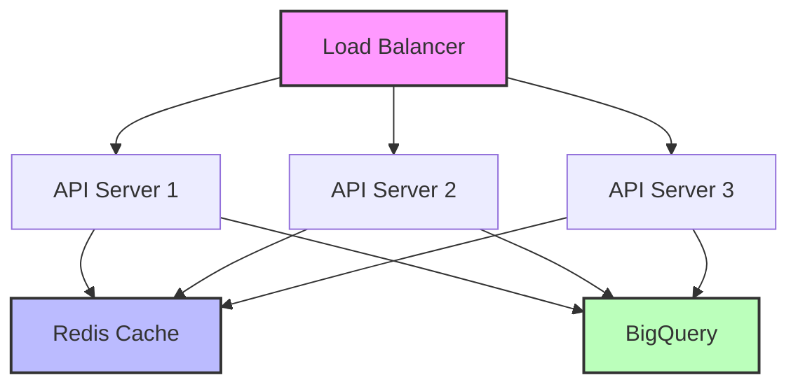

# Performance Guide 🚀

## System Architecture



## Performance Limits

### 1. Query Limits
- Maximum data processed: 500MB
- Maximum rows returned: 10
- Query timeout: 30 seconds
- Maximum concurrent queries: 5

### 2. API Limits
- Request timeout: 60 seconds
- Maximum request size: 1MB
- Rate limit: 10 requests/minute
- Maximum concurrent connections: 100

### 3. Memory Limits
- Session history: 5 conversations
- Token context: 8192 tokens
- Cache size: 100MB
- Maximum file size: 10MB

## Query Optimization

### 1. BigQuery Best Practices



#### Example Optimizations:

1. **Use Date Partitioning**
```sql
-- Bad
SELECT *
FROM `streamings_fact`
WHERE DATE(start_datetime) >= '2024-01-01'

-- Good
SELECT *
FROM `streamings_fact`
WHERE start_datetime >= TIMESTAMP('2024-01-01')
```

2. **Select Specific Columns**
```sql
-- Bad
SELECT *
FROM `content_dimension`
JOIN `showtime_fact` ON content_id

-- Good
SELECT 
  c.title,
  c.genre,
  s.local_show_datetime
FROM `content_dimension` c
JOIN `showtime_fact` s ON c.content_id = s.content_id
```

3. **Optimize Joins**
```sql
-- Bad
SELECT *
FROM `content_dimension` c
LEFT JOIN `theatrical_run` t ON c.content_id = t.content_id
LEFT JOIN `streaming_run` s ON c.content_id = s.content_id

-- Good
SELECT *
FROM `content_dimension` c
JOIN (
  SELECT content_id FROM `theatrical_run`
  UNION ALL
  SELECT content_id FROM `streaming_run`
) runs ON c.content_id = runs.content_id
```

### 2. Memory Management



#### Cache Configuration
```python
CACHE_CONFIG = {
    'MAX_SIZE': 100_000_000,  # 100MB
    'TTL': 3600,              # 1 hour
    'HISTORY_LENGTH': 5,      # conversations
    'PRUNE_THRESHOLD': 0.9    # 90% full
}
```

## Monitoring

### 1. Performance Metrics



#### Key Metrics
```python
METRICS = {
    'response_time': Histogram(
        'api_response_seconds',
        'API response time in seconds',
        buckets=[0.1, 0.5, 1.0, 2.0, 5.0]
    ),
    'query_bytes': Counter(
        'bigquery_bytes_processed',
        'BigQuery bytes processed'
    ),
    'token_usage': Counter(
        'openai_tokens_used',
        'OpenAI token usage'
    ),
    'error_count': Counter(
        'api_errors_total',
        'Total API errors'
    )
}
```

### 2. Cost Optimization

#### Query Cost Control
```python
QUERY_LIMITS = {
    'max_bytes': 500_000_000,  # 500MB
    'max_rows': 10,
    'timeout': 30,             # seconds
    'concurrent': 5
}

def estimate_query_cost(query: str) -> float:
    """Estimate BigQuery cost before execution"""
    dry_run = client.query(query, job_config=QueryJobConfig(dry_run=True))
    bytes_processed = dry_run.total_bytes_processed
    return bytes_processed * COST_PER_TB / 1e12
```

#### Token Usage Optimization
```python
TOKEN_LIMITS = {
    'context': 8192,
    'response': 1000,
    'history': 4096
}

def optimize_prompt(text: str, max_tokens: int) -> str:
    """Trim prompt to fit token budget"""
    encoding = tiktoken.encoding_for_model("gpt-4")
    tokens = encoding.encode(text)
    if len(tokens) <= max_tokens:
        return text
    return encoding.decode(tokens[:max_tokens])
```

## Scaling Strategies

### 1. Horizontal Scaling



### 2. Caching Strategy

#### Response Cache
```python
@cached(
    cache=TTLCache(maxsize=1000, ttl=3600),
    key=lambda question, context: hashlib.sha256(
        f"{question}:{context}".encode()
    ).hexdigest()
)
async def process_question(question: str, context: str) -> dict:
    """Process question with caching"""
    return await generate_response(question, context)
```

#### Schema Cache
```python
SCHEMA_CACHE = TTLCache(maxsize=100, ttl=86400)  # 24 hours

def get_table_schema(table: str) -> dict:
    """Get BigQuery table schema with caching"""
    if table in SCHEMA_CACHE:
        return SCHEMA_CACHE[table]
    
    schema = client.get_table(table).schema
    SCHEMA_CACHE[table] = schema
    return schema
```

## Performance Testing

### 1. Load Testing
```python
async def load_test(
    concurrent_users: int,
    requests_per_user: int,
    delay: float
) -> dict:
    """Run load test"""
    async with aiohttp.ClientSession() as session:
        tasks = []
        for _ in range(concurrent_users):
            task = asyncio.create_task(
                user_session(session, requests_per_user, delay)
            )
            tasks.append(task)
        results = await asyncio.gather(*tasks)
    return analyze_results(results)
```

### 2. Query Testing
```python
def benchmark_query(query: str, iterations: int = 10) -> dict:
    """Benchmark query performance"""
    times = []
    bytes_processed = []
    
    for _ in range(iterations):
        start = time.time()
        job = client.query(query)
        results = job.result()
        duration = time.time() - start
        
        times.append(duration)
        bytes_processed.append(job.total_bytes_processed)
    
    return {
        'avg_time': statistics.mean(times),
        'avg_bytes': statistics.mean(bytes_processed),
        'p95_time': statistics.quantiles(times, n=20)[18],
        'p95_bytes': statistics.quantiles(bytes_processed, n=20)[18]
    }
``` 