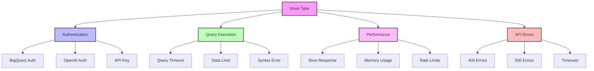
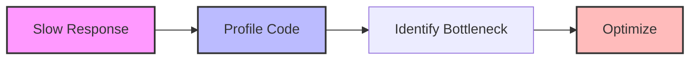
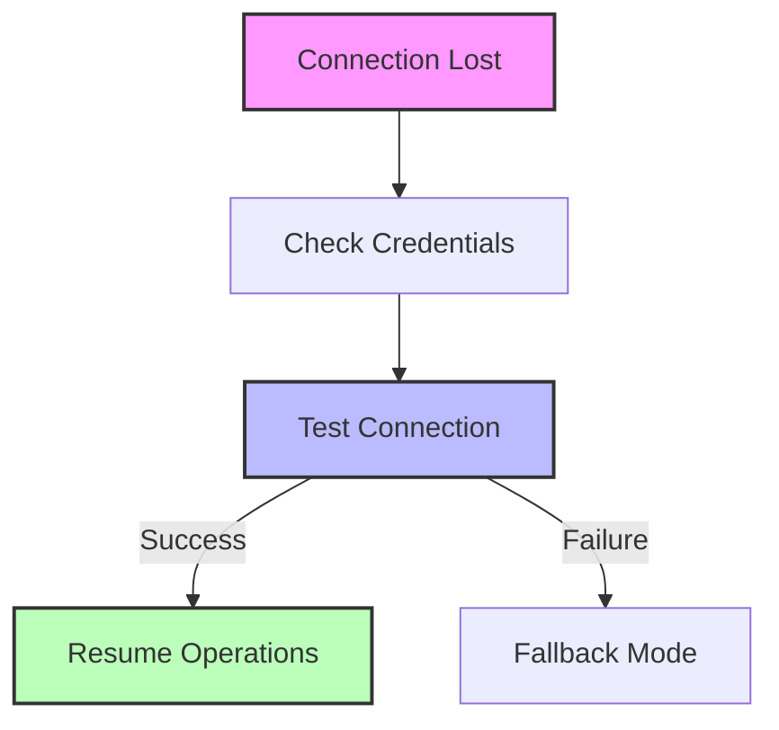

# Troubleshooting Guide 🔧

## Common Issues



## 1. Authentication Issues

### BigQuery Authentication

#### Problem: Service Account Not Found
```
google.auth.exceptions.DefaultCredentialsError: Could not automatically determine credentials
```

**Solution:**
1. Check environment variable:
```bash
echo $GOOGLE_APPLICATION_CREDENTIALS
```

2. Verify file exists:
```python
import os
assert os.path.exists('service_account.json')
```

3. Test credentials:
```python
from google.cloud import bigquery
client = bigquery.Client()
client.query("SELECT 1").result()
```

### OpenAI Authentication

#### Problem: Invalid API Key
```
openai.error.AuthenticationError: Invalid API key provided
```

**Solution:**
1. Check environment:
```python
import os
assert 'OPENAI_API_KEY' in os.environ
```

2. Test API:
```python
import openai
response = openai.ChatCompletion.create(
    model="gpt-4",
    messages=[{"role": "user", "content": "test"}]
)
```

## 2. Query Issues

### Query Timeout

#### Problem: Query Takes Too Long
```
google.api_core.exceptions.Timeout: Query exceeded maximum execution time
```

**Solution:**
```python
def optimize_query(query: str) -> str:
    """Add query optimization hints"""
    return f"""
    -- Add query hints
    @{
      'timeoutMs': 30000,
      'maximumBytesBilled': 500000000
    }
    
    {query}
    """
```

### Data Limit Exceeded

#### Problem: Query Too Large
```
Query exceeded limit for bytes billed: 500000000
```

**Solution:**
```python
def estimate_and_limit_query(query: str) -> str:
    """Estimate and limit query size"""
    # Dry run to estimate size
    job_config = bigquery.QueryJobConfig(dry_run=True)
    job = client.query(query, job_config=job_config)
    bytes = job.total_bytes_processed

    if bytes > 500_000_000:
        raise ValueError(
            f"Query would process {bytes/1e6:.1f}MB. "
            "Try limiting the date range or adding filters."
        )
    return query
```

## 3. Performance Issues

### Slow Response Times



#### Profiling Code
```python
import cProfile
import pstats

def profile_request(question: str):
    """Profile request processing"""
    profiler = cProfile.Profile()
    profiler.enable()
    
    result = process_question(question)
    
    profiler.disable()
    stats = pstats.Stats(profiler).sort_stats('cumtime')
    stats.print_stats()
    
    return result
```

### Memory Usage

#### Problem: High Memory Usage
```python
def monitor_memory():
    """Monitor memory usage"""
    import psutil
    process = psutil.Process()
    memory_info = process.memory_info()
    
    if memory_info.rss > 500_000_000:  # 500MB
        logger.warning(
            "High memory usage",
            memory_mb=memory_info.rss/1e6
        )
```

## 4. API Errors

### Common HTTP Errors

#### 400 Bad Request
```python
from fastapi import HTTPException
from fastapi.responses import JSONResponse

@app.exception_handler(HTTPException)
async def http_exception_handler(request, exc):
    """Handle HTTP exceptions"""
    return JSONResponse(
        status_code=exc.status_code,
        content={
            "error": exc.detail,
            "type": "validation_error"
            if exc.status_code == 400
            else "server_error"
        }
    )
```

#### 500 Server Error
```python
@app.exception_handler(Exception)
async def general_exception_handler(request, exc):
    """Handle unexpected errors"""
    logger.exception("Unexpected error")
    return JSONResponse(
        status_code=500,
        content={
            "error": "Internal server error",
            "type": "server_error",
            "detail": str(exc) if DEBUG else None
        }
    )
```

## Debugging Tools

### 1. Request Logging

```python
import structlog
logger = structlog.get_logger()

async def log_request(request: Request):
    """Log request details"""
    logger.info(
        "incoming_request",
        method=request.method,
        url=str(request.url),
        client=request.client.host,
        headers=dict(request.headers)
    )
```

### 2. Query Debugging

```python
def debug_query(query: str):
    """Debug query execution"""
    # Dry run
    job_config = bigquery.QueryJobConfig(dry_run=True)
    job = client.query(query, job_config=job_config)
    print(f"Bytes to be processed: {job.total_bytes_processed:,}")
    
    # Explain plan
    explain = client.query(f"EXPLAIN {query}").result()
    for row in explain:
        print(row.plan_nodes)
```

## Error Messages

### User-Friendly Messages
```python
ERROR_MESSAGES = {
    'query_timeout': (
        "Your query took too long to complete. Try reducing the "
        "date range or adding more specific filters."
    ),
    'data_limit': (
        "This query would process too much data. Please narrow "
        "your search or use more specific filters."
    ),
    'auth_error': (
        "Authentication failed. Please check your API key and try again."
    ),
    'rate_limit': (
        "Too many requests. Please wait a moment before trying again."
    )
}
```

## Health Checks

### System Health
```python
async def check_system_health():
    """Check system components"""
    checks = {
        'database': check_database(),
        'openai': check_openai(),
        'memory': check_memory(),
        'disk': check_disk_space()
    }
    
    return {
        'status': 'healthy' if all(checks.values())
        else 'unhealthy',
        'checks': checks
    }
```

## Recovery Procedures

### 1. Database Recovery



### 2. API Recovery
```python
from tenacity import retry, stop_after_attempt, wait_exponential

@retry(
    stop=stop_after_attempt(3),
    wait=wait_exponential(multiplier=1, min=4, max=10)
)
async def resilient_request(question: str):
    """Retry failed requests with exponential backoff"""
    return await process_question(question)
``` 