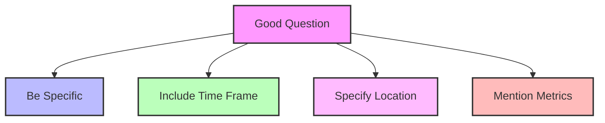
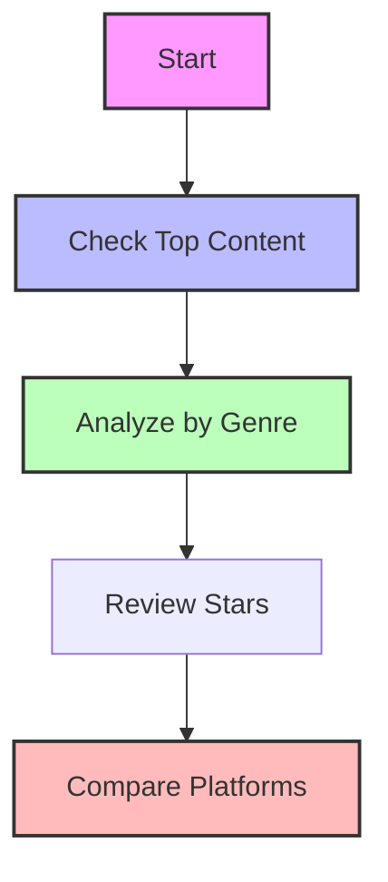

# Usage Guide 📝

## Overview

The SQL Agent helps you query your data using natural language. It translates your questions into SQL and provides insights from the results.


## Question Types

### 1. Content Analysis

#### Movies by Genre
```
Q: What are the top action movies by showtime count this month?

Response:
{
    "query": "SELECT c.title, COUNT(*) as showings
             FROM content_dimension c
             JOIN showtime_fact s ON c.content_id = s.content_id
             WHERE c.genre = 'Action'
             AND DATE(s.local_show_datetime) >= DATE_SUB(CURRENT_DATE(), INTERVAL 30 DAY)
             GROUP BY c.title
             ORDER BY showings DESC
             LIMIT 10",
    "result": [
        ["title", "showings"],
        ["Movie 1", "156"],
        ["Movie 2", "143"]
    ],
    "insights": "Action movies are showing strong performance this month..."
}
```

#### Star Performance
```
Q: Which actors appeared in the most movies last year?

Response:
{
    "query": "SELECT s.star_name, COUNT(DISTINCT c.content_id) as movie_count
             FROM star_dimension s
             JOIN content_star_mapping m ON s.star_id = m.star_id
             JOIN content_dimension c ON m.content_id = c.content_id
             WHERE EXTRACT(YEAR FROM c.release_date) = EXTRACT(YEAR FROM CURRENT_DATE()) - 1
             GROUP BY s.star_name
             ORDER BY movie_count DESC
             LIMIT 10",
    "result": [
        ["star_name", "movie_count"],
        ["Actor 1", "5"],
        ["Actor 2", "4"]
    ],
    "insights": "Actor 1 had a particularly productive year..."
}
```

### 2. Performance Analysis

#### Cinema Performance
```
Q: Which cinemas had the highest attendance rate in London?

Response:
{
    "query": "SELECT 
                c.cinema_name,
                COUNT(s.showtime_id) as total_shows,
                AVG(s.seats_available) as avg_seats_left
             FROM cinema_dimension c
             JOIN showtime_fact s ON c.cinema_id = s.cinema_id
             WHERE c.city = 'London'
             GROUP BY c.cinema_name
             ORDER BY avg_seats_left ASC
             LIMIT 10",
    "result": [
        ["cinema_name", "total_shows", "avg_seats_left"],
        ["Cinema 1", "200", "15.5"],
        ["Cinema 2", "180", "18.2"]
    ],
    "insights": "Cinema 1 shows consistently high attendance..."
}
```

### 3. Streaming Analytics

#### Platform Performance
```
Q: How are different streaming platforms performing?

Response:
{
    "query": "SELECT 
                ch.channel_name,
                COUNT(*) as stream_count,
                AVG(sf.duration_seconds)/60 as avg_minutes_watched
             FROM channel_dimension ch
             JOIN streamings_fact sf ON ch.channel_id = sf.channel_id
             WHERE DATE(sf.start_datetime) >= DATE_SUB(CURRENT_DATE(), INTERVAL 7 DAY)
             GROUP BY ch.channel_name
             ORDER BY stream_count DESC
             LIMIT 10",
    "result": [
        ["channel_name", "stream_count", "avg_minutes_watched"],
        ["Platform 1", "10000", "45.5"],
        ["Platform 2", "8000", "52.3"]
    ],
    "insights": "Platform 1 leads in total streams while Platform 2 shows higher engagement..."
}
```

## Best Practices

### 1. Question Formulation



#### Good Questions:
- "What were the top 5 movies by ticket sales in London last month?"
- "Which actors appeared in more than 3 movies released in 2023?"
- "What's the average streaming duration for action movies on Platform 1?"

#### Less Effective Questions:
- "Show me movies" (too vague)
- "All cinema data" (too broad)
- "Best performance" (metrics undefined)

### 2. Using Context

```python
# Maintain conversation context
question = "How did they perform last week?"
context = {
    'previous_question': "Show me top cinemas in London",
    'previous_entities': {
        'location': 'London',
        'subject': 'cinemas',
        'metric': 'performance'
    }
}
```

### 3. Time Ranges

#### Effective Date Ranges:
```sql
-- Last 30 days
DATE(datetime_column) >= DATE_SUB(CURRENT_DATE(), INTERVAL 30 DAY)

-- Current year
EXTRACT(YEAR FROM date_column) = EXTRACT(YEAR FROM CURRENT_DATE())

-- Specific month
DATE_TRUNC(date_column, MONTH) = DATE_TRUNC(DATE '2024-03-01', MONTH)
```

### 4. Performance Tips

#### Limit Data Processing
```python
# Good: Specific time range and filters
question = "What are the top 10 movies in Germany this month?"

# Bad: Too broad
question = "Show all movies and their performance"
```

#### Use Specific Metrics
```python
# Good: Clear metrics
question = "What's the average ticket price and attendance rate for IMAX showings?"

# Bad: Unclear metrics
question = "How are IMAX movies doing?"
```

## Example Workflows

### 1. Content Performance Analysis



#### Example Session:
1. "What are the top 10 movies by total viewers this month?"
2. "How do these movies break down by genre?"
3. "Who are the most featured stars in these movies?"
4. "How are these movies performing on streaming vs theaters?"

### 2. Regional Analysis


#### Example Session:
1. "Show me all cinemas in London"
2. "What are their average ticket prices?"
3. "Which movies are most popular in these cinemas?"
4. "How does this compare to other cities?"

## Advanced Features

### 1. Comparative Analysis
```
Q: Compare performance of action vs comedy movies this year

Response: {detailed comparison with metrics}
```

### 2. Trend Analysis
```
Q: Show me the trending genres over the last 6 months

Response: {trend analysis with growth rates}
```

### 3. Cross-Platform Analysis
```
Q: How does content perform across theatrical and streaming releases?

Response: {platform comparison with insights}
```

## Tips for Better Results

### 1. Query Optimization
- Specify time ranges
- Include location filters
- Mention specific metrics
- Use clear comparisons

### 2. Result Interpretation
- Review SQL for accuracy
- Check data freshness
- Consider context
- Validate assumptions

### 3. Session Management
- Maintain context
- Build on previous questions
- Refine gradually
- Save important insights 